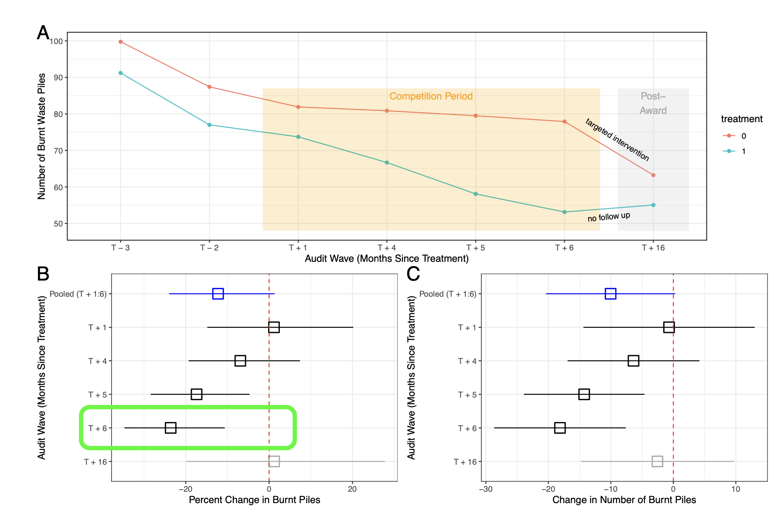

```{r setup, echo=FALSE, warning=FALSE, message=FALSE}
knitr::opts_chunk$set(echo = TRUE, warning = FALSE, message = FALSE)
library(rmarkdown)
```

------------------------------------------------------------------------

### Figure: Map of Treatment Assignment Zones in Nansana, Uganda 

    * SOURCE: Figure from Buntaine et al., 2024 (S5; Supplemental Materials)
  


------------------------------------------------------------------------

### Open source data & applied study:

Open access data was utilized for this class exercise from the study (Buntaine et al., 2024):

> Buntaine, M. T., Komakech, P., & Shen, S. V. (2024). *Social competition drives collective action to reduce informal waste burning in Uganda*. Proceedings of the National Academy of Sciences, 121(23). https://doi.org/10.1073/pnas.2319712121

------------------------------------------------------------------------

### Outline - What are the goals of this exercise?

#### 1.  Start with a simple OLS model

#### 2.  Demonstrate the rationale for estimating progressively complex models

#### 3.  Illustrate a causal inference approach (i.e., identify `robust` estimators)

#### 4. Conclusion: What is the take-home message of the Lab-1 exercise? . . .

    Estimating complex models is a relatively easy part of our work as data scientists...

    * Making informed specification decisions & communicating results is the hard part
    (i.e., the science side of `data science`)!  
    
------------------------------------------------------------------------

In this tutorial I use `this text style` to highlight:

-  Statistical jargon - E.g., `Ordinary Least Squares (OLS)`
-  Variable names - E.g., `predictor_x`
-  In-text R code - E.g., `here::here()`

------------------------------------------------------------------------

### Let's get started!

```{r}
library(tidyverse)   # Keeping things tidy (https://www.tidyverse.org/packages/)
library(janitor)     # Housekeeping (https://cran.r-project.org/web/packages/janitor/vignettes/janitor.html)
library(here)        # Location, location, location (https://here.r-lib.org/)
library(jtools)      # Pretty regression output (https://jtools.jacob-long.com/)
library(gt)          # Tables (https://gt.rstudio.com/)
library(gtsummary)   # Table for checking balance (https://www.danieldsjoberg.com/gtsummary/)
library(performance) # Check model diagnostics (https://easystats.github.io/performance/index.html)
```

------------------------------------------------------------------------

### Getting to know our data example - analysis variables

```{r}
variable_descriptions <- tribble(
  ~"Label", ~"Description",  
 #----------|-------------|,
  "zoneid" , "Zone or neighborhood ID: The observational unit (N=44)",   
  "waste_piles" , "The outcome variable (Y): The number of waste pile burns recorded (Range; 5, 125)",  
  "treat" , "The treatment assignment variable (0 = Control Group; 1 = Treatment Group)"
 )

gt(variable_descriptions) %>% 
    tab_header(title = "Focal Variables - Evaluating Treatment Effects"  # Add a title
  ) %>%
  tab_style(style = cell_text(weight = "bold"),
    locations = cells_column_labels()  # Make header row bold
  ) 
```

### Read in the Nansana experiment data (Buntaine et al., 2024)

```{r data-in}

#waste pile count data:
counts_gpx <- read_csv(here("data", "waste_pile_counts_gpx.csv")) %>% 
    rename("waste_piles" = "total",
           "rain_0_48hrs" = "rf_0_to_48_hours",
           "rain_49_168hrs" = "rf_49_to_168_hours") %>% 
    filter(survey%in%c(
      "post_treatment_1","post_treatment_2","post_treatment_3",
      "post_treatment_4","post_treatment_5"))

#select subset of post-treatment periods (remove time point 5):
post_treat_subset <- counts_gpx %>% 
   filter(survey == "post_treatment_4")
```

------------------------------------------------------------------------

### Model 1: Simple OLS estimator

Review of regression: Ordinary Least Squares (OLS)

------------------------------------------------------------------------

```{r, eval=FALSE}

m1_ols <- 

summ(m1_ols, model.fit = FALSE)
```

### Are we making reasonable assumptions?

    Let's take a quick look at our outcome variable `waste piles`!

```{r}
post_treat_subset %>%
  ggplot(aes(x = waste_piles)) +
  geom_histogram(binwidth = 5, fill = "blue", color = "white", alpha = 0.7) +
  labs(title = "Histogram of Waste Piles",
    x = "Waste Piles (counts)",
    y = "Count") +
    theme_minimal()

```

### Check model assumption: normality of residuals

Make a QQ plot displaying residuals (y-axis) compared to the normal distribution (x-axis)

```{r}
check_model(m1_ols,  check = "qq" )
```

**Key takeaways:** 

-   Hmmm... our outcome is a count variable 
-   Is the OLS assumption, *normality of residuals*, a good fit for the data?
-   Probably not, let's do away with normality!

------------------------------------------------------------------------

###  Relax- time to generalize!

-   We can `relax` the normality assumption
-   The outcome `waste_piles` is a `count variable`, not a true continuous variable
-   We can try out a common estimator used for count outcomes, `Poisson regression`
-   Let's estimate a `Generalized Linear Model (GLM)`

------------------------------------------------------------------------

### Model 2: Poisson Generalized Linear Regression Model

-   Poisson regression explicitly models the outcome as a count variable
-   Assumes `Y` follows a Poisson distribution with non-negative integers (counts!)
-   Poisson regression makes an additional assumption- that variance (dispersion) is proportional to the mean 

    Does the data match the theoretical distribution proposed?

```{r}
lambda_hat <- mean(post_treat_subset$waste_piles)

poisson_curve <- tibble(
  x = seq(0, max(post_treat_subset$waste_piles), by = 1),  # Range of x values
  density = dpois(seq(0, max(post_treat_subset$waste_piles), by = 1), 
                  lambda = mean(post_treat_subset$waste_piles)) 
)

ggplot(post_treat_subset, aes(x = waste_piles)) +
  geom_histogram(aes(y = ..density..), binwidth = 5, color = "white", fill = "blue", alpha = 0.7) + 
  geom_line(data = poisson_curve, aes(x = x, y = density), color = "red", size = 1) +  # Poisson curve
  geom_density(color = "green", size = 1, adjust = 1.5) +  # KDE for a smoother curve
  labs(
    title = "Plot of Empirical (Green) v. Theoretical (Red) Distributions",
    x = "Waste Pile Counts",
    y = "Density"
  ) +
  theme_minimal()

```

### Ok, lets try estimating a Poisson model using `glm()`
```{r, eval=FALSE}
m2_poisson <- 

summ(m2_poisson, model.fit = FALSE)

```

**Check overdispersion assumption**
```{r}
check_overdispersion(m2_poisson)
```

**Key takeaways:**

-   This test implies the dispersion (variance) is significantly larger than the mean!
-   The Poisson regression model assumes dispersion is proportional to the mean (`dispersion = mean`)
-   We can see from our previous plot that the data has significant overdispersion (`dispersion > mean`)
-   A common solution, add a dispersion parameter (e.g., estimate a `negative binomial model`)

**Intuition check:** The new estimate values are on a different scale...

-   The coefficients returned by `glm()` are now on the `log scale` (i.e., `exp(coef) = Odds Ratio`)
-   Notice in the GLM function we specified the distribution as, `family = poisson(link = "log")`
-   Alternative specification option- use a simple `log transformation` to get comparable result
-   Importantly, the `log-OLS` regression model coefficients are intuitive to interpret

------------------------------------------------------------------------

### Model 3: Simple is best! - the econometricians trick

------------------------------------------------------------------------

-   The `Log-OLS regression` estimator works similarly to Poisson regression but with different assumptions
-   Instead of modeling the count directly, we transform the outcome variable by taking the *natural log* 

```{r, eval=FALSE}
m3_log <- 

summ(m3_log, model.fit = FALSE)
```


### Compare observed data to simulated data based on the fitted model (`m3_log`)
```{r}
check_predictions(m3_log, verbose = FALSE)
```

**Key takeaways:**

-   The estimate produced using log-OLS are conveniently interpreted as the `percent change in the outcome`!
-   Log-OLS is widely used in econometrics for count outcomes because it is simple and effective
-   This model is popular due to its ease of interpretation and extensive documentation

------------------------------------------------------------------------

### Comparing model output - Let's take a look at the models we've estimated side-by-side
```{r}
export_summs(m1_ols, m2_poisson, m3_log,
             model.names = c("OLS","Poisson GLM","Log(Outcome) OLS"),
             statistics = "none")
```

------------------------------------------------------------------------

### Let's do some quick math to compare treatment effect estimates
```{r}
# Calculate percent change in waste piles in each model:

m1_est_ols = (-24.77/77.91)*100  # % change = -31.8
m2_est_poi = (exp(-.38) -1)*100  # % change = -31.6
m3_est_log = (-0.42)*100         # % change = -42

```

------------------------------------------------------------------------

### Analysis check-in: 

    So far the log-OLS regression model is the best fitting model we have specified 

**The treatment estimate for log-OLS can be interpret as follows:**

> *The model estimated that the treatment group had a 42% reduction in waste piles relative to the control group.*

-   This estimate, however, is still not a robust causal effect (the OLS estimator is still a bit naive)
-   Any ideas why this might be? - Discuss with you neighbor (Think. Pair. Share.)

------------------------------------------------------------------------

### Let's take a look at covariate balance across treatment conditions

    Specifically, `pre_count_avg` (pre-treatment waste pile counts)

```{r}

post_treat_subset %>% 
    select(treat, waste_piles, pre_count_avg) %>% 
    tbl_summary(
        by = treat,
        statistic = list(all_continuous() ~ "{mean} ({sd})")) %>% 
    modify_header(label ~ "**Variable**") %>%
    modify_spanning_header(c("stat_1", "stat_2") ~ "**Treatment**") 
    
```

------------------------------------------------------------------------

### Model 4: Moving towards casual inference

------------------------------------------------------------------------

-   Is this experiment a `Randomized Controlled Trial (RCT)`?
-   Not quite - What about `selection bias/OVB`?
-   Recall that the study researchers selected contiguous neighborhood pairs to compete in the intervention
-   This assignment procedure could plausibly introduce selection bias (contaminating our treatment effect) 
-   It's **always** important to check for balance on pre-treatment baseline characteristics (to check if randomization worked)
-   Luckily, we can `control away` known sources of selection bias by adding `pre_count_avg` to the OLS model

```{r, eval=FALSE}

m4_control <- lm(
    log(waste_piles) ~ 
        treat + 
        , ## Add control
    data = post_treat_subset)

summ(m4_control, model.fit = FALSE)

```

------------------------------------------------------------------------

### Model 5: Does the enviroment stand still during our experiment?

------------------------------------------------------------------------

**No!** We should account for events that might also affect trash burning during the treatment period

    I.e., Anything else that might affect the number of trash piles burned (besides our treatment)

-   Trash pile burning in these neighborhoods may vary by weather conditions
-   Note: We will also switch to using `heteroskedasticity robust` standard errors (*more on this later!*)

------------------------------------------------------------------------

### Look at balance across treatment conditions for average rain events
```{r}

post_treat_subset %>% 
    select(treat, waste_piles, rain_0_48hrs, rain_49_168hrs) %>% 
    tbl_summary(
        by = treat,
        statistic = list(all_continuous() ~ "{mean} ({sd})")) %>% 
    modify_header(label ~ "**Variable**") %>% 
    modify_spanning_header(c("stat_1", "stat_2") ~ "**Treatment**") 
    
```

### Add controls for rain events during the competition period
```{r, eval=FALSE}
m5_control2 <- lm(
    log(waste_piles) ~ 
        treat +
        log(pre_count_avg) + 
        , ## Add control
    data = post_treat_subset)

summ(m5_control2,
     model.fit = FALSE, )  ## Add heteroskedasticity robust standard error adj.
```

### Comparing models after adding controls
```{r, eval=FALSE}
export_summs(m4_control, m5_control2, robust = "HC2",
             model.names = c("M4 - Pre-treat","M5 - Add Rain"),
             statistics = "none")

```

------------------------------------------------------------------------

### Model 6: Are neighborhoods `independent`?

-   We have another issue which may bias our treatment effect - the neighborhoods were paired together
-   We have to account for this `paired data` feature which is called `clustered data`
-   **Why?** Clustered data violates the regression assumption that observations are `independent and identically distributed (i.i.d)`
-   In-other-words, the data has within group `dependencies`, paired neighborhoods will likely be more similar than un-paired neighborhoods
-   This structure of the data should be modeled

------------------------------------------------------------------------

```{r, eval=FALSE}

m6_clust <- lm(
    log(waste_piles) ~ 
        treat +
        log(pre_count_avg) +
        rain_0_48hrs + rain_49_168hrs,
    data = post_treat_subset)

summ(m6_clust,
     robust = "HC2", # Add SE based on pair-clusters
     model.fit = FALSE)

```


------------------------------------------------------------------------

**Key takeaways:**

-   Our treatment effect result is `robust` (remains unchanged) after adding the standard error adjustment
-   **NOTE**: That the standard error (`SE`) is slightly more `conservative` (i.e., the SE increased)
-   After accounting for dependencies by pair clusters the `SE` increased by .01 
-   However, our interpretation of the treatment effect remains unchanged 
-   The treatment was found to reduce waste pile burning by 27% (`p<.001`).

    Model `M6` replicates the treatment effect reported in Buntaine et al., 2024 (see Figure 2; T+6)
    
------------------------------------------------------------------------
   
### Figure 2 adapted from Buntaine et al. (2024) - Replication of `T+6` treatment estimate 
  


------------------------------------------------------------------------
